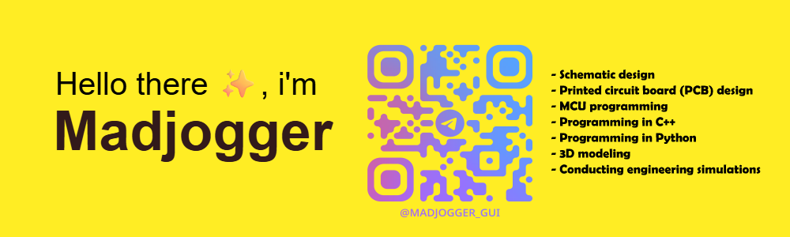
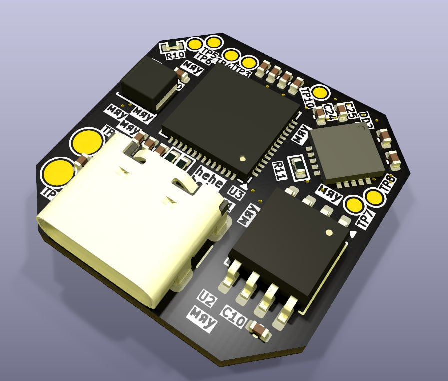

#  10 YEARS EXPERIENCE IN EMBEDDED   

<table>
  <td> PCB:</td>
  <td>
    
    
    
    
  </td>
  <td rowspan="4">
      
    </td>
  <tr>
    <td>
     MCAD:
  </td>
  <td>
    
    
    
    
  </td>
  </tr>
  <tr>
    <td>
     EMCAD:
  </td>
  <td>
    
    
    
    
    
  </td>
  </tr>
  <tr>
    <td>
     CODE:
  </td>
  <td>
    
    
    
    
    
    
  </td>
  </tr>
</table>

<table style="width: 100%; table-layout: fixed;">
  <tr>
    <td style="width: 30%; white-space: normal; word-wrap: break-word; vertical-align: top;">
       PCB:
    </td>
    <td style="width: 40%; white-space: normal; word-wrap: break-word; vertical-align: top;">
      
      
      
      
    </td>
    <td rowspan="4" style="width: 30%; vertical-align: top;">
      
    </td>
  </tr>
  <tr>
    <td style="white-space: normal; word-wrap: break-word; vertical-align: top;">
       MCAD:
    </td>
    <td style="white-space: normal; word-wrap: break-word; vertical-align: top;">
      
      
      
      
    </td>
  </tr>
  <tr>
    <td style="white-space: normal; word-wrap: break-word; vertical-align: top;">
       EMCAD:
    </td>
    <td style="white-space: normal; word-wrap: break-word; vertical-align: top;">
      
      
      
      
      
    </td>
  </tr>
  <tr>
    <td style="white-space: normal; word-wrap: break-word; vertical-align: top;">
       CODE:
    </td>
    <td style="white-space: normal; word-wrap: break-word; vertical-align: top;">
      
      
      
      
      
      
    </td>
  </tr>
</table>

****˙✧˖°📷 ༘ ⋆｡˚ I have a bunch of projects on my kinda landing page here˙✧˖°📷 ༘ ⋆｡˚**** https://madjogger.notion.site/656cc937f4074dd89f5f39d0a024b2e6?pvs=4

**You can find there some of my ideas and current projects**

🛠𝄃𝄃𝄂𝄂𝄀𝄁𝄃𝄂𝄂𝄃𝄃𝄃𝄂𝄂𝄀𝄁𝄃𝄂𝄂𝄃𝄃𝄃𝄂𝄂𝄀𝄁𝄃𝄂𝄂𝄃𝄃𝄃𝄂𝄂𝄀𝄁𝄃𝄂𝄂𝄃𝄃𝄃𝄂𝄂𝄀𝄁𝄃𝄂𝄂𝄃𝄃𝄃𝄂𝄂𝄀𝄁𝄃𝄂𝄂𝄃𝄃𝄃𝄂𝄂𝄀𝄁𝄃𝄂𝄂𝄃𝄃𝄃𝄂𝄂𝄀𝄁𝄃𝄂𝄂𝄃𝄃𝄃𝄂𝄂𝄀𝄁𝄃𝄂𝄂𝄃𝄃𝄃𝄂𝄂𝄀𝄁𝄃𝄂𝄂𝄃𝄃𝄃𝄂𝄂𝄀🛠

***for any questions or collaborations i can be found on Telegram: [@madjogger](https://t.me/madjogger)***
