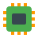

#  10 YEARS EXPERIENCE IN EMBEDDED   

##  My stack:
####  PCB:     
####  MCAD:     

####  EMCAD:       

####  CODE:        

****˙✧˖°📷 ༘ ⋆｡˚ I have a bunch of projects on my kinda landing page here˙✧˖°📷 ༘ ⋆｡˚**** https://madjogger.notion.site/656cc937f4074dd89f5f39d0a024b2e6?pvs=4

**You can find there some of my ideas and current projects**

🛠𝄃𝄃𝄂𝄂𝄀𝄁𝄃𝄂𝄂𝄃𝄃𝄃𝄂𝄂𝄀𝄁𝄃𝄂𝄂𝄃𝄃𝄃𝄂𝄂𝄀𝄁𝄃𝄂𝄂𝄃𝄃𝄃𝄂𝄂𝄀𝄁𝄃𝄂𝄂𝄃𝄃𝄃𝄂𝄂𝄀𝄁𝄃𝄂𝄂𝄃𝄃𝄃𝄂𝄂𝄀𝄁𝄃𝄂𝄂𝄃𝄃𝄃𝄂𝄂𝄀𝄁𝄃𝄂𝄂𝄃𝄃𝄃𝄂𝄂𝄀𝄁𝄃𝄂𝄂𝄃𝄃𝄃𝄂𝄂𝄀𝄁𝄃𝄂𝄂𝄃𝄃𝄃𝄂𝄂𝄀𝄁𝄃𝄂𝄂𝄃𝄃𝄃𝄂𝄂𝄀🛠

***for any questions or collaborations i can be found on Telegram: [@madjogger](https://t.me/madjogger)***
